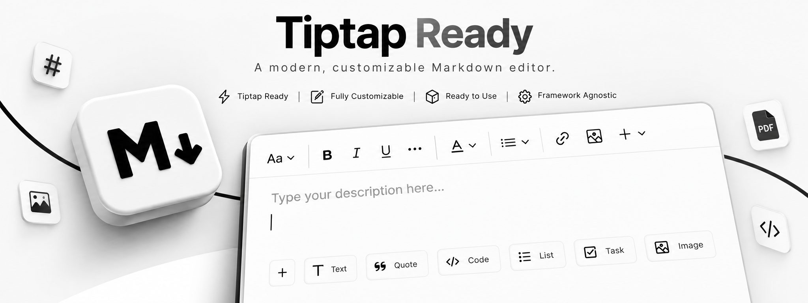

# Tiptap Mini Ready

A modern TipTap editor for React.

TipTap v3 · Customizable · Ready to use · React

Maintained by [Bora Ata Türkoğlu](https://github.com/boracomet). Styled with [shadcn/ui](https://ui.shadcn.com).

Live demo: [https://boracomet.github.io/tiptap-mini-ready/](https://boracomet.github.io/tiptap-mini-ready/)

The demo stacks Comment, Gallery, and Article. Under Templates, the Notion-like block is a demo template (no TipTap Cloud AI/collab): a slash menu and a floating toolbar.

Repository: [https://github.com/boracomet/tiptap-mini-ready](https://github.com/boracomet/tiptap-mini-ready)

## Installation

From the component registry:

```bash
npx shadcn@latest add https://raw.githubusercontent.com/boracomet/tiptap-mini-ready/main/registry/block-registry.json
```

### Manual installation

Install the editor dependencies:

```bash
npm install lowlight react-medium-image-zoom @radix-ui/react-icons @tiptap/extension-bubble-menu @tiptap/extension-code-block-lowlight @tiptap/extension-color @tiptap/extension-horizontal-rule @tiptap/extension-image @tiptap/extension-list @tiptap/extension-table @tiptap/extension-text-style @tiptap/markdown @tiptap/extension-typography @tiptap/extensions @tiptap/pm @tiptap/react @tiptap/starter-kit
```

Wrap the app in `TooltipProvider`:

```tsx
import { TooltipProvider } from "@/components/ui/tooltip"

export const App = () => {
  return (
    <TooltipProvider>
      <YourComponent />
    </TooltipProvider>
  )
}
```

Shadcn components used by the editor: Button, Dropdown Menu, Input, Label, Popover, Separator, Switch, Toggle, Tooltip, Dialog, Toggle Group, and Sonner.

In this Vite app, `components.json` points Tailwind CSS at `src/global.css` (there is no separate `tailwind.config.ts`).

Reference your Tailwind entry from the editor stylesheet:

```css
@reference "path-to-your-entry-point-tailwind.css";
```

## Usage

```tsx
import { useState } from "react"
import { Content } from "@tiptap/react"
import { MinimalTiptapEditor } from "./minimal-tiptap"

export const App = () => {
  const [value, setValue] = useState<Content>("")

  return (
    <MinimalTiptapEditor
      value={value}
      onChange={setValue}
      className="w-full"
      editorContentClassName="p-5"
      output="html"
      placeholder="Enter your description..."
      autofocus={true}
      editable={true}
      editorClassName="focus:outline-hidden"
    />
  )
}
```

`value` is controlled. External updates, including a form reset, replace the document when the incoming value differs from the editor content. Keystrokes are not written back with `setContent` when the content already matches.

## Props

The editor accepts standard Tiptap editor props plus:

| Prop                     | Type                                     | Default | Description                                |
| ------------------------ | ---------------------------------------- | ------- | ------------------------------------------ |
| `value`                  | `Content`                                | -       | Controlled editor content                  |
| `onChange`               | function                                 | -       | Called when the document changes           |
| `editorContentClassName` | string                                   | -       | Class for the editor content container     |
| `output`                 | `'html' \| 'json' \| 'text' \| 'markdown'` | `'html'` | Output format passed to `onChange`      |
| `placeholder`            | string                                   | -       | Placeholder text                           |
| `editorClassName`        | string                                   | -       | Class for the editable surface             |
| `throttleDelay`          | number                                   | `0`     | Delay in milliseconds before `onChange`   |
| `uploader`               | `(file: File) => Promise<string>`        | -       | Replaces the demo image upload             |

## Images

Toolbar uploads, and drop or paste, insert a blob URL first. The image node then calls `uploadFn` and swaps in the returned URL. Dropped or pasted files do not stay inline as base64 when an uploader is configured.

```typescript
Image.configure({
  allowedMimeTypes: ["image/jpeg", "image/png", "image/gif"],
  maxFileSize: 5 * 1024 * 1024,
  uploadFn: async (file) => {
    return "https://example.com/uploaded-image.jpg"
  },
})
```

If `uploadFn` is omitted, the demo uploader returns a data URL after a short delay. Validation and action errors are reported through the `onValidationError` and `onActionError` callbacks.

## Toolbar

```tsx
<SectionOne editor={editor} activeLevels={[1, 2, 3, 4, 5, 6]} variant="outline" />

<SectionTwo
  editor={editor}
  activeActions={["bold", "italic", "strikethrough", "code", "clearFormatting"]}
  mainActionCount={2}
/>

<SectionFour editor={editor} activeActions={["orderedList", "bulletList"]} mainActionCount={0} />

<SectionFive editor={editor} activeActions={["codeBlock", "blockquote", "horizontalRule"]} mainActionCount={0} />
```

Active toolbar buttons use the toggle pressed state. Text colors follow the `dark` class set by `next-themes`, not only the operating system color scheme.

Links are saved through one path: the URL is sanitized, `target="_blank"` also sets `rel="noopener noreferrer"`, and saving does not insert a new paragraph.

## Development

```bash
pnpm install
pnpm dev
pnpm build
pnpm test
```

Rebuild the shadcn registry after changing the editor component:

```bash
pnpm build-registry
```

Host it locally:

```bash
pnpm host-registry
npx shadcn@latest add http://127.0.0.1:8080/block-registry.json -o
```

## Demo deployment

Pushes to `main` run `.github/workflows/deploy-demo.yml`, which builds this Vite app and publishes GitHub Pages. In the repository settings, set Pages to **GitHub Actions** once. The site is served from `/tiptap-mini-ready/`.

## Attribution

Tiptap Mini Ready is maintained by Bora Ata Türkoğlu. The editor is derived from the MIT-licensed minimal-tiptap component. The original copyright notice is kept in [LICENSE](LICENSE).

For a broader official editor, see the [Tiptap simple editor template](https://tiptap.dev/docs/ui-components/templates/simple-editor).
